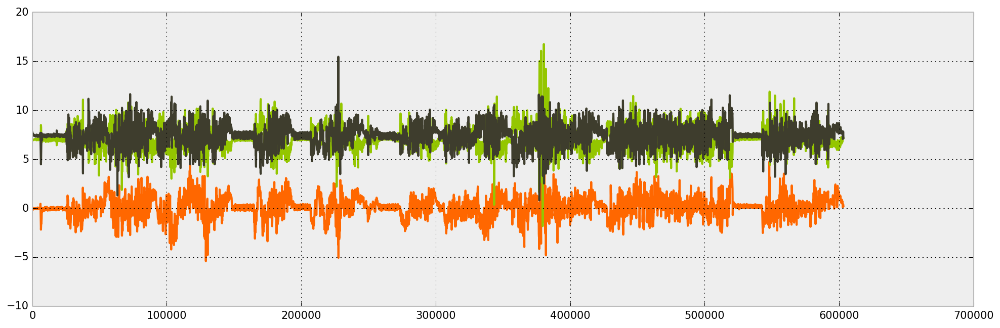

Matplotlib Style
=======================

Style Configuration for Matplotlib

How?
-------------------------

Place the `matplotlibrc` file in following folders:

* MacOS in `~\.matplotlib`
* Linux in '/home/yourusername/.config/matplotlib/

Style
----------------------------

A little `R`-like style.

